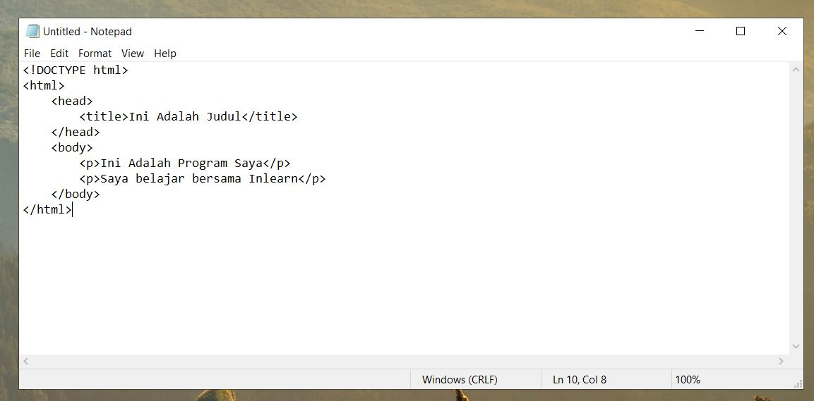

# Kode Editor

Untuk membuat halaman web atau melakukan koding HTML, maka kita perlu menyiapkan kode editor. Kode editor berfungsi sebagai alat untuk melakukan pembuatan atau pengeditan koding atau syntax. Salah satu kode atau text editor yang paling umum dan ada pada setiap OS Windows adalah notepad.

## Notepad

Notepad merupakan text editor bawaan windows, sehingga kamu tidak perlu mendownload notepad lagi. Cara membuka notepad cukup mudah, yakni dengan menekan tombol `windows`, lalu ketik `notepad` atau kamu bisa menggunakan dengan cara pintas yakni dengan menekan `windows + r`, lalu ketik `notepad` dan tekan `enter`. Dengan itu kamu telah masuk ke dalam notepad dan siap membuat kodingan. Notepad disarankan jika kamu membuat program yang bersifat untuk sekedar belajar atau uji coba \(syntax atau kodingan pendek\).

## Visual Studio Code

Gambar diatas merupakan tampilan dari visual studio code. Visual Studio Code \(VSC\) merupakan salah satu text editor yang sangat populer dan diminati oleh banyak kalangan programmer. VSC tersindiri merupakan kode editor keluaran windows pada tanggal 29 April 2015. VSC memiliki banyak kelebihan diantaranya memiliki tampilan visual yang unik dan terang sehingga memudahkan programmer untuk melihat kekurangan kode atau kesalahan dalam menuliskan syntax, VSC menyediakan banyak plugin atau ekstensi yang semakin memudahkan kita dalam menuliskan koding salah satu ekstensi VSC yang paling berguna oleh programmer adalah "Emmet" yang berguna sebagai pemberi saran atau memperkirakan syntax apa yang kita pakai sehingga efektif dalam membuat koding dan cocok untuk orang yang terkadang lupa pada sebagian kata atau huruf syntaxnya. Visual Studio Code ini dapat kamu unduh secara gratis di situs resminya atau kamu bisa unduh [disini](https://code.visualstudio.com/download).

## Sublime Text

Sublime Text adalah kode atau text editor yang bisa dikatakan hampir sama dengan VSC, namun sublime text memiliki ukuran yang relatif lebih ringan dibandingkan VSC. Kini, sublime text telah berada versi keempat nya. Sublime Text dapat digunakan dengan gratis \(walau dengan batasan tertentu\). Kamu dapat mengunduh Sublime Text melalui situs resminya atau kamu bisa unduh [disini](https://www.sublimetext.com/3).

## Kode Editor Online

Saat ini kemajuan teknologi telah semakin maju dengan pesat. Kita dapat melakukan kodingan melalui website secara online bahkan dapat menyimpan file kodingan tersebut. Kelebihan dari kode editor online ini kita tidak perlu repot-repot melakukan instalasi atau pemasangan kode editor. Menggunakan kode editor online sangat kami sarankan apabila kamu belajar pemograman dari web dan juga disarankan menggunakannya ketika berada pada halaman ini, sehingga kamu dapat mudah membuka kode editor tanpa perlu melakukan instalasi dan lebih ringan memakan memori. Salah satu kode editor online yang disarankan adalah [playcode.io](https://playcode.io/) . Kamu dapat menggunakannya secara gratis \(dengan batasan tertentu\) dan hanya perlu akses ke internet saja.

## Kontribusi

Terima Kasih telah memberikan kontribusinya 

* Ikram Wadudu

